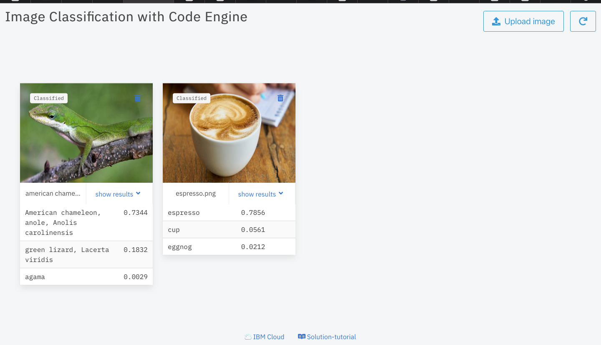

# Image Classification with Code Engine and TensorFlow

## Build the container images

Run the below command to build and push three container images - frontend, backend and backend-job respectively.
   ```
   ./deploy.sh <DOCKER_ACCOUNT_NAME>
   ```

## Use the container images with the solution tutorial
Once you the container images, follow the steps in the [solution tutorial](https://cloud.ibm.com/docs/solution-tutorials?topic=solution-tutorials-text-analysis-code-engine) and use this code sample to learn about [IBM Cloud™ Code Engine](https://cloud.ibm.com/codeengine/overview) by deploying an image classification application.

> - Use the container images built from this code sample. Replace `ibmcom/*` with `<ACCOUNT_NAME>/*` container images.
> - Instead of uploading a text file, upload an image (.jpeg, .png) to COS. For sample images, **check the images folder in this repo.**

### Expected output



